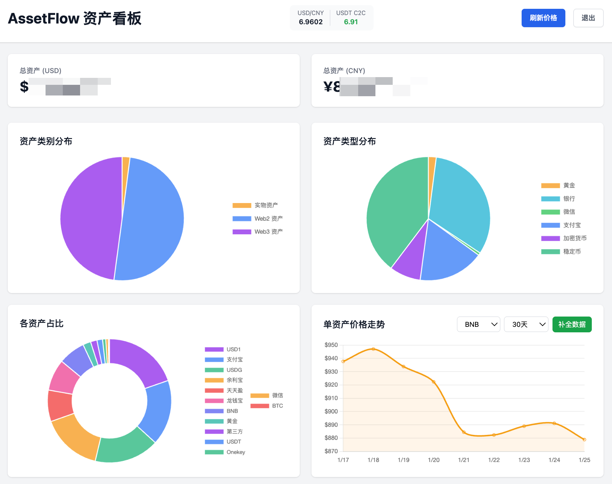
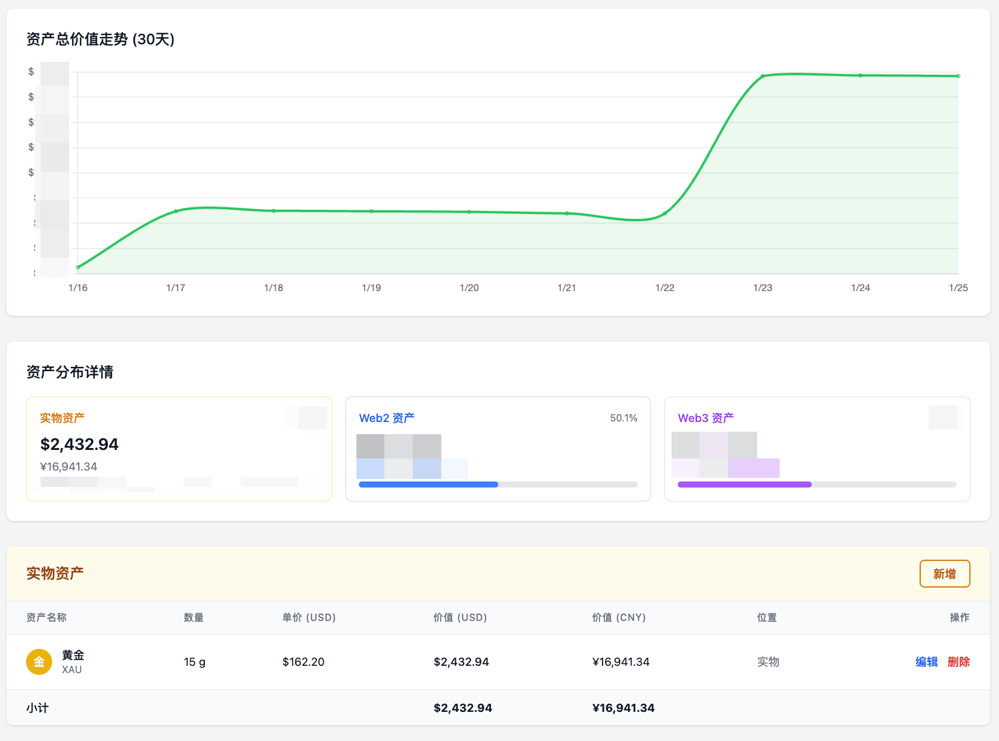
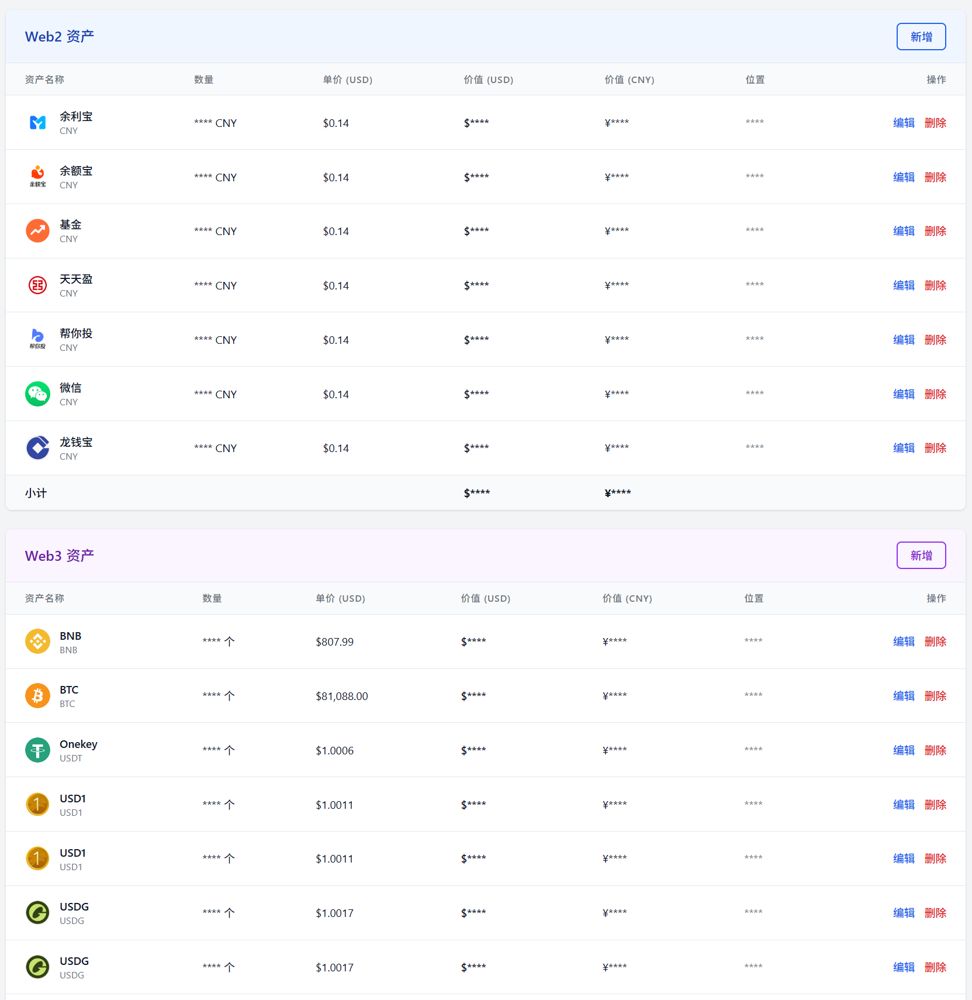

# AssetFlow

<div align="center">

**📊 一个开源的、可自部署的 Web3 资产看板应用**

支持 Web2 和 Web3 资产管理 | 实时价格跟踪 | 响应式设计

[English](README_EN.md) | 简体中文

</div>

---

## 📸 应用截图

<div align="center">


*资产看板主界面 - 资产分布可视化、实时价格追踪*


*资产总值趋势图 - 30天价值变化、分类资产详情*


*隐私模式 - 一键隐藏敏感数据，安全展示给他人*

</div>

---

## ✨ 特性

- 🌐 **多资产类型支持**：Web2 资产（银行、支付宝、微信）、Web3 资产（交易所、钱包、DeFi）、实物资产（贵金属、外汇）
- 💹 **实时价格更新**：集成 CoinGecko API，实时获取加密货币价格
- 📱 **响应式设计**：完美适配桌面端和移动端
- 🔒 **本地数据存储**：所有数据存储在本地 SQLite 数据库，保护隐私
- 👁️ **隐私模式**：一键隐藏敏感数据（金额、数量、位置），安全展示给他人
- 📈 **可视化图表**：使用 Chart.js 展示资产分布和变动趋势
- 🎨 **现代化 UI**：基于 Vue 3 + Tailwind CSS 构建，界面美观易用
- 🚀 **快速部署**：一键启动，无需复杂配置

---

## 🎯 核心功能

### 资产管理

- ✅ 添加、编辑、删除资产记录
- ✅ 资产分类（Web2/Web3/实物）
- ✅ 资产转账记录
- ✅ 实时计算资产总值

### 价格追踪

- ✅ 加密货币实时价格（通过 CoinGecko API）
- ✅ 汇率自动转换（U → RMB）
- ✅ 价格历史记录

### 数据可视化

- ✅ 资产分布饼图
- ✅ 资产价值趋势图
- ✅ 多维度数据统计

---

## 🚀 快速开始

### 环境要求

- Node.js >= 16.x
- npm 或 yarn

### 安装步骤

1. **克隆项目**

```bash
git clone https://github.com/yourusername/AssetFlow.git
cd AssetFlow
```

2. **安装依赖**

```bash
npm install
```

3. **启动开发服务器**

```bash
npm run dev
```

前端将运行在 `http://localhost:1456`，后端 API 运行在 `http://localhost:1457`

> [!NOTE]
> **首次运行说明**：
> - 首次启动时，应用会自动在 `data/` 目录下创建 SQLite 数据库文件 `assetflow.db`
> - 数据库会自动初始化所有必要的表结构（资产、价格缓存、汇率、价格历史等）
> - 系统会插入一些示例数据，帮助你快速了解应用功能
> - 你可以直接编辑或删除这些示例数据，添加你自己的资产
> - 数据库文件已在 `.gitignore` 中排除，不会上传到 GitHub，保护你的隐私

4. **访问应用**

在浏览器中打开 `http://localhost:1456`，首次访问时你可以设置一个访问密码（可选）。

### 生产部署

1. **构建生产版本**

```bash
npm run build
```

2. **启动生产服务器**

```bash
PORT=1456 npm run start
```

3. **后台持久运行（推荐使用 pm2）**

```bash
# 安装 pm2
npm install -g pm2

# 启动服务
PORT=1456 pm2 start server/index.js --name assetflow

# 设置开机自启
pm2 save
pm2 startup
```

> [!TIP]
> **生产模式优势**：
> - 预编译的静态文件，页面加载更快
> - JS/CSS 文件已压缩和代码分割
> - 单一端口访问，无需代理配置

---

## 📁 项目结构

```
AssetFlow/
├── src/                    # Vue 前端源码
│   ├── components/         # Vue 组件
│   ├── App.vue            # 主应用组件
│   ├── api.js             # API 调用封装
│   ├── main.js            # 应用入口
│   └── style.css          # 全局样式
├── server/                 # Node.js 后端服务
│   ├── index.js           # Express 服务器
│   ├── api.js             # API 路由
│   └── db.js              # SQLite 数据库操作
├── data/                   # 数据目录
│   └── assetflow.db       # SQLite 数据库（自动生成）
├── assets/                 # 静态资源
├── css/                    # 额外样式文件
├── js/                     # 额外 JavaScript 文件
├── index.html             # 主 HTML 文件
├── vite.config.js         # Vite 配置
├── tailwind.config.js     # Tailwind CSS 配置
├── package.json           # 项目依赖
├── 系统设计.md             # 系统设计文档
└── README.md              # 本文件
```

---

## 🔌 API 集成

### CoinGecko API

AssetFlow 使用 [CoinGecko API](https://www.coingecko.com/en/api) 获取实时加密货币价格。

- **免费额度**：30 次/分钟
- **支持币种**：BTC、ETH、BNB、USDT 等主流币种

### 汇率 API

支持通过汇率 API 实时转换法币价格。

---

## 💻 使用指南

### 添加资产

1. 点击 **"添加资产"** 按钮
2. 选择资产类型（Web2/Web3/实物）
3. 填写资产名称、符号、数量等信息
4. 保存后会自动计算资产价值

### 资产转账

1. 选择源资产和目标资产
2. 填写转账数量
3. 系统自动更新两个资产的余额

### 查看统计

- **总览页面**：查看总资产价值、资产分布
- **图表页面**：查看资产价值变动趋势
- **历史记录**：查看所有交易记录

---

## 🛠️ 技术栈

### 前端

- **Vue 3**：渐进式 JavaScript 框架
- **Vite**：下一代前端构建工具
- **Tailwind CSS**：实用优先的 CSS 框架
- **Chart.js**：灵活的 JavaScript 图表库
- **Axios**：HTTP 客户端

### 后端

- **Node.js**：JavaScript 运行环境
- **Express**：Web 应用框架
- **SQLite**：嵌入式数据库
- **sql.js**：JavaScript 中的 SQLite

---

## 🔒 隐私与安全

- ✅ **本地存储**：所有数据存储在本地 SQLite 数据库
- ✅ **隐私模式**：点击眼睛按钮一键隐藏金额、数量、存放位置等敏感信息
- ✅ **无需注册**：无需账号，直接使用
- ✅ **数据可控**：可随时备份或导出数据
- ✅ **开源透明**：代码完全开源，可审计

---

## 📝 开发计划

- [x] 隐私模式（一键隐藏敏感数据）
- [ ] 支持更多加密货币和法币
- [ ] 添加数据导入/导出功能（JSON、CSV）
- [ ] 支持多钱包地址管理
- [ ] 添加价格提醒功能
- [ ] 支持深色模式
- [ ] PWA 支持（离线使用）
- [ ] 多语言支持

---

## 🤝 贡献

欢迎贡献代码、提出建议或报告问题！

1. Fork 本项目
2. 创建特性分支 (`git checkout -b feature/AmazingFeature`)
3. 提交更改 (`git commit -m 'Add some AmazingFeature'`)
4. 推送到分支 (`git push origin feature/AmazingFeature`)
5. 开启 Pull Request

---

## 📄 许可证

本项目采用 MIT 许可证。详见 [LICENSE](LICENSE) 文件。

---

## 🙏 致谢

- [CoinGecko](https://www.coingecko.com/) - 提供加密货币价格 API
- [Vue.js](https://vuejs.org/) - 优秀的前端框架
- [Tailwind CSS](https://tailwindcss.com/) - 实用的 CSS 框架
- [Chart.js](https://www.chartjs.org/) - 强大的图表库

---

## 📧 联系方式

如有问题或建议，请通过以下方式联系：

- 提交 [Issue](https://github.com/ranxi2001/AssetFlow/issues)
- 发送邮件至：ranxi.cn@gmail.com

---

<div align="center">

**⭐ 如果这个项目对你有帮助，请给个 Star！⭐**

Made with ❤️ by AssetFlow Team

</div>
